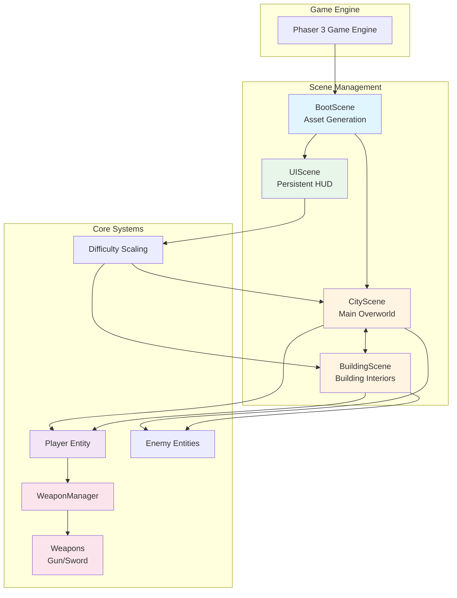
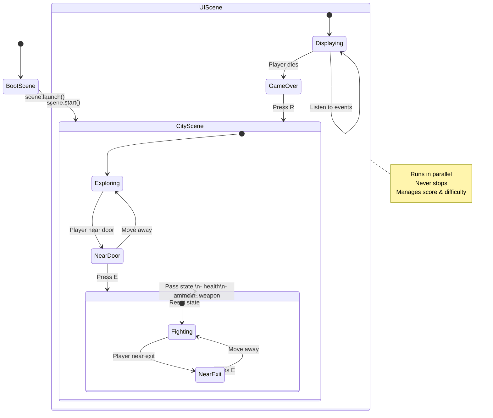
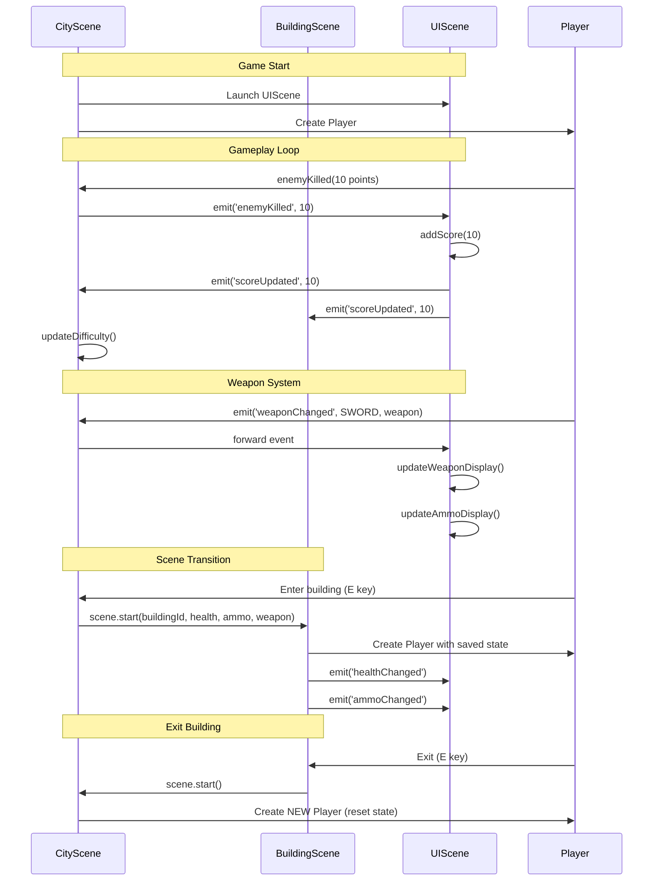
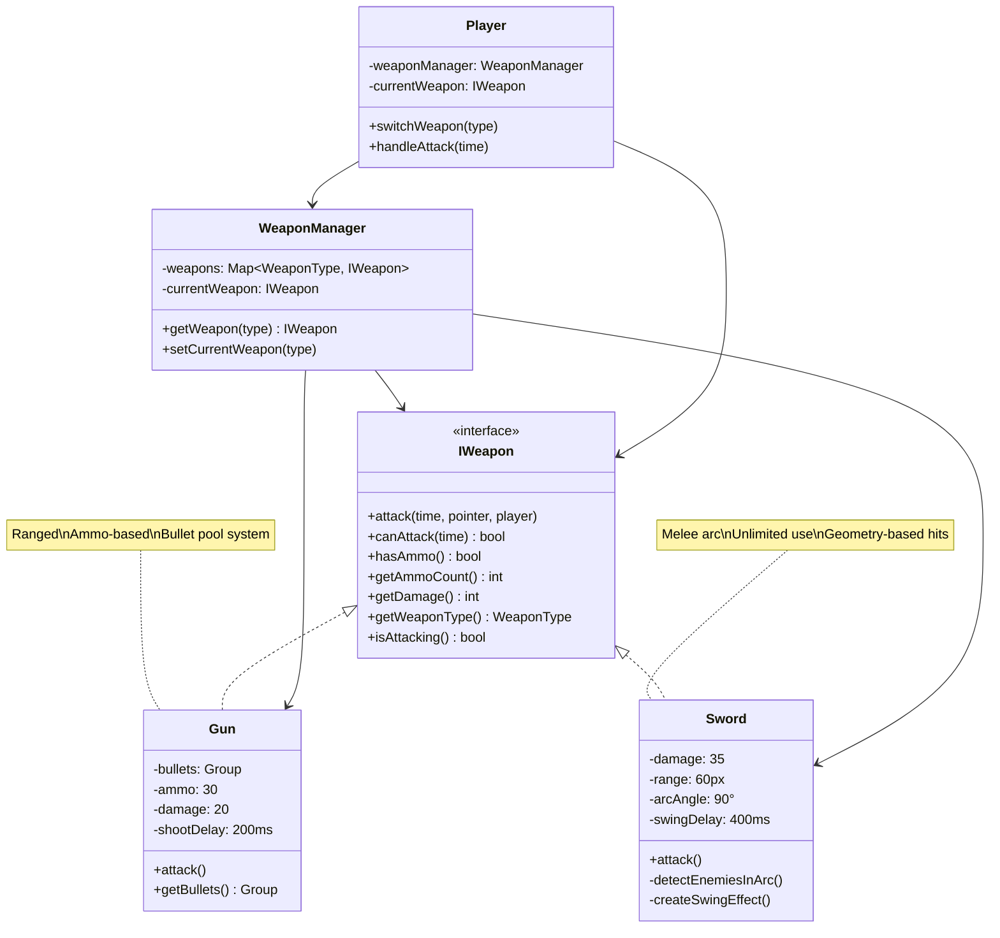
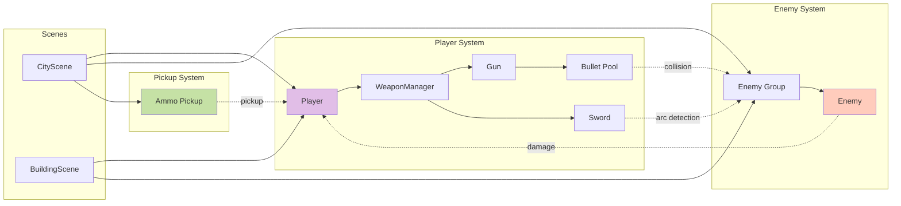
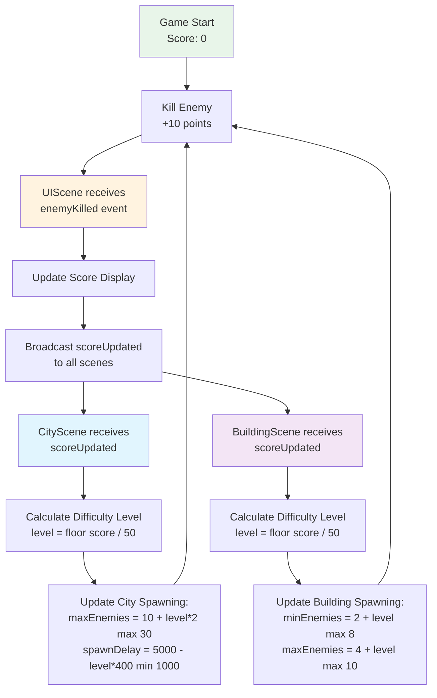
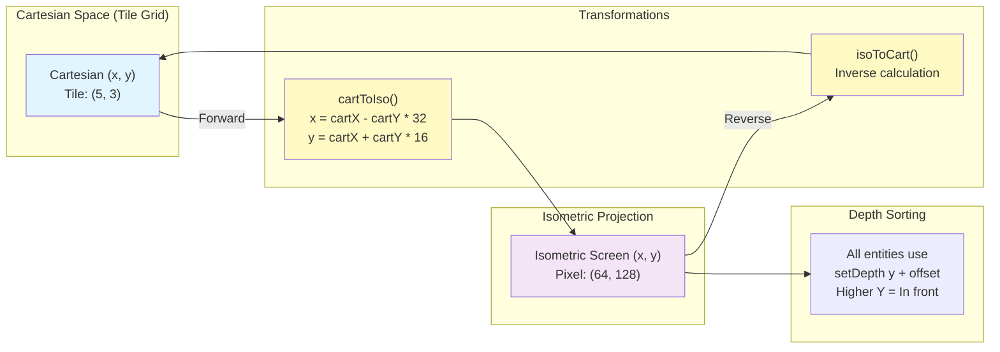
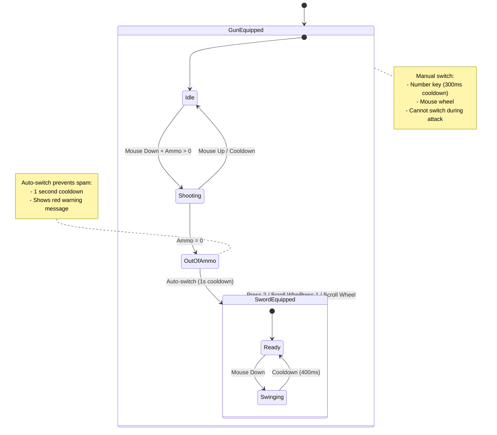
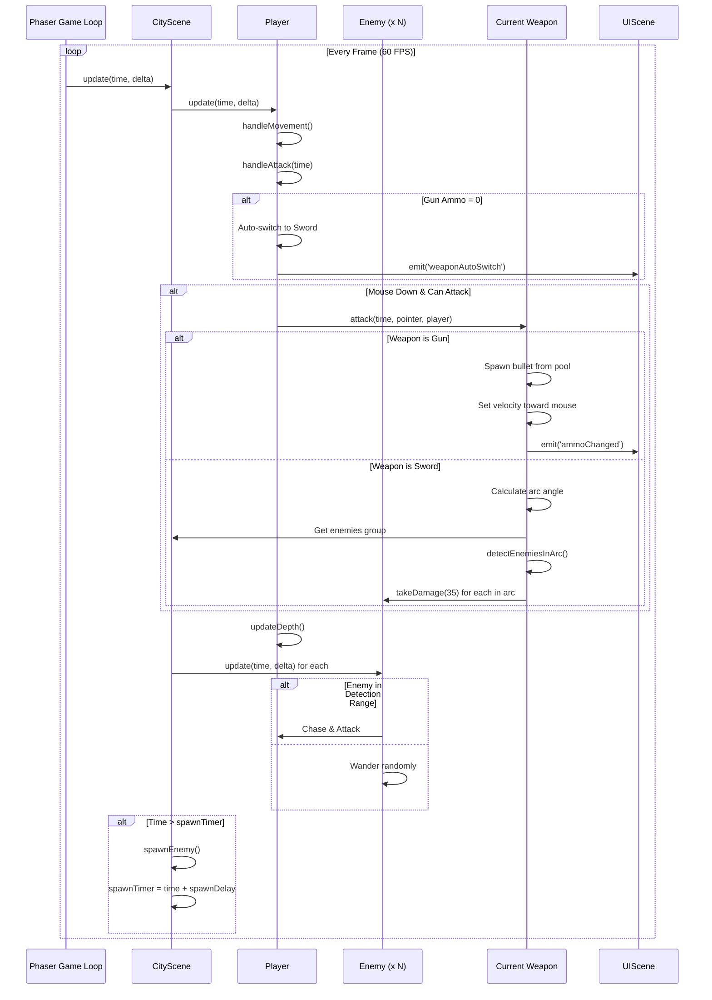
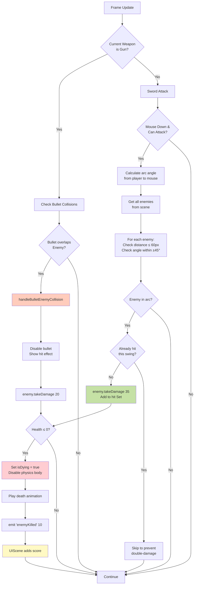

# Architecture Documentation

## System Overview

## Scene Flow Diagram

## Scene Communication & Events

## Weapon System Architecture

## Entity Relationships

## Difficulty Scaling System

## Isometric Coordinate System

## Player Input & Weapon Switching

## Game Loop & Update Cycle

## Collision Detection Flow

