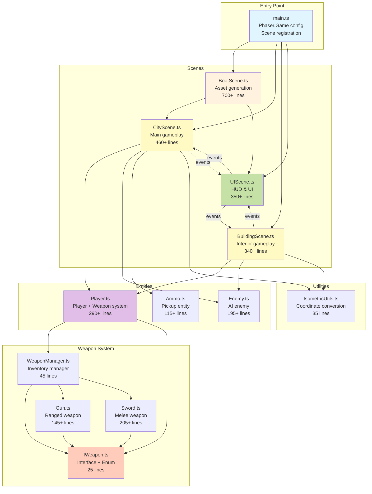
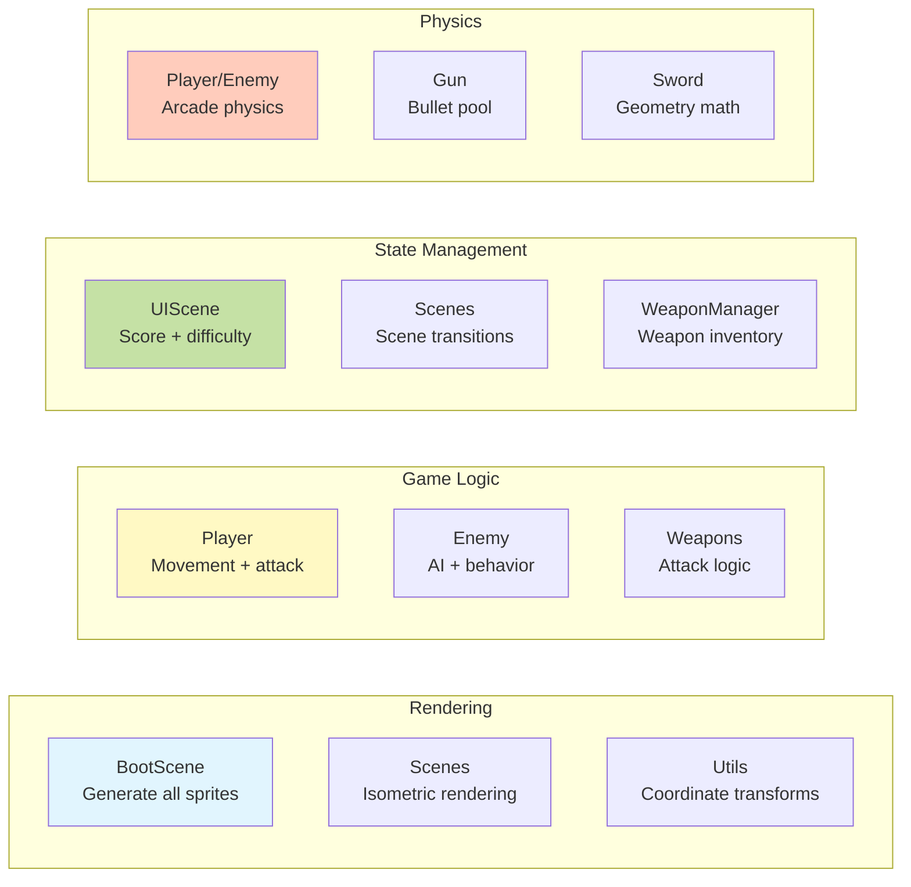
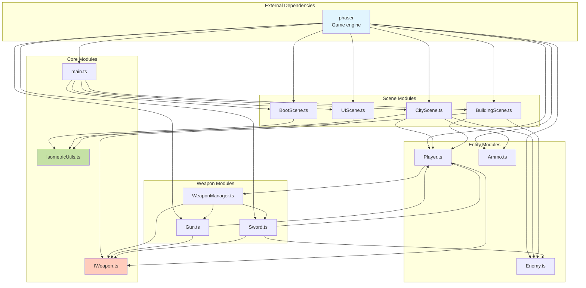
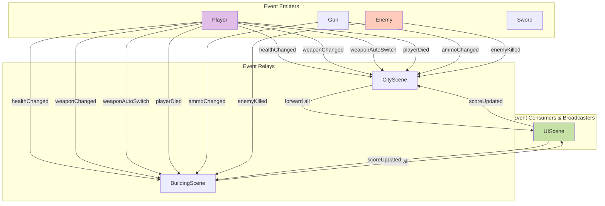
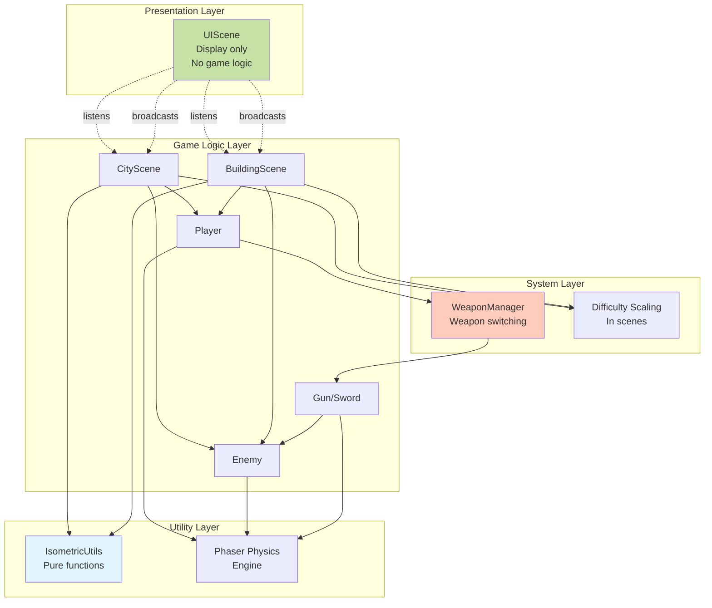
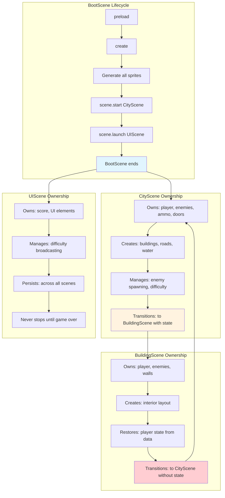
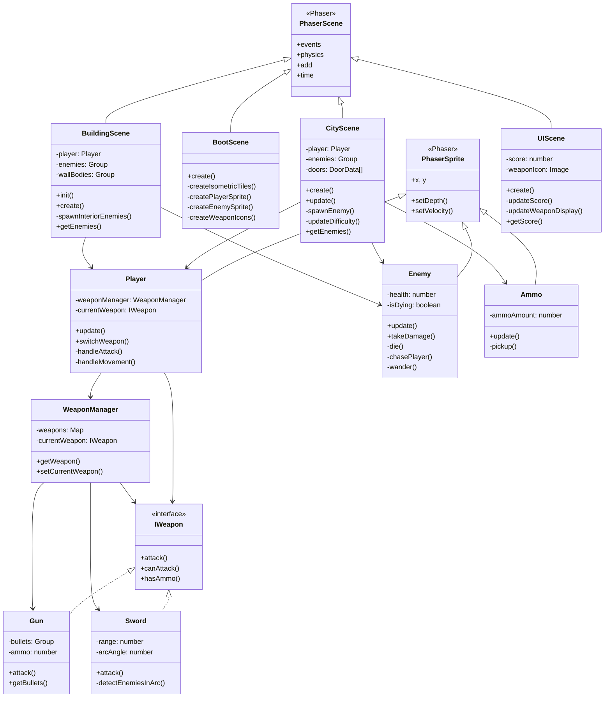
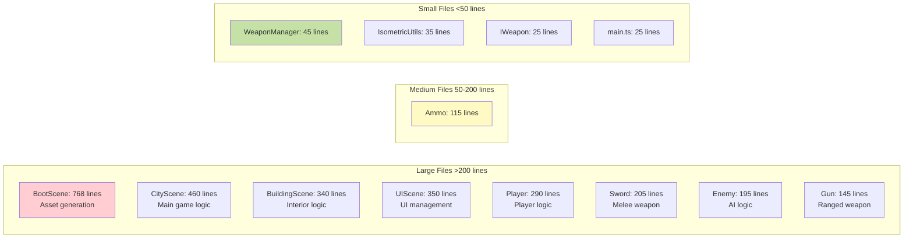
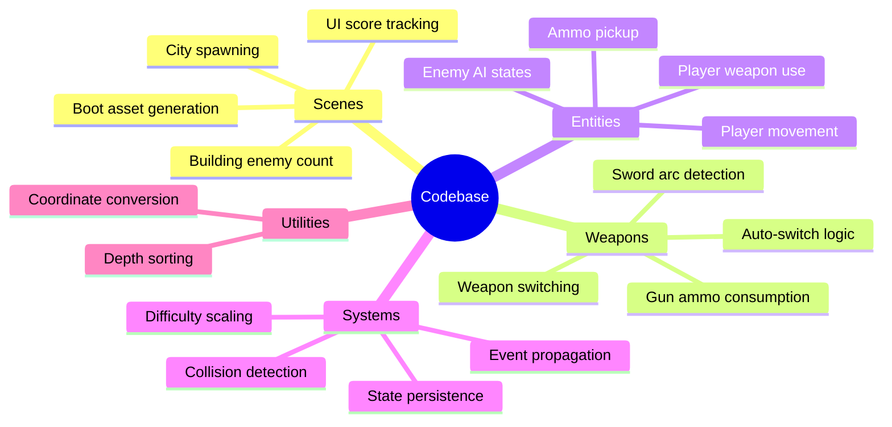

# Codebase Map

Complete visual map of the entire codebase showing all files and their relationships.

## Complete System Dependency Graph



## File Responsibility Matrix



## Module Import Graph



## Event Communication Map



## Data Flow Layers



## Scene Ownership & Lifecycle



## Class Hierarchy



## File Size & Complexity



## Testing Points



## Critical Dependencies

```
TypeScript → Compilation
Phaser 3 → Game engine
  ├── Arcade Physics → Collision
  ├── Scene Management → Lifecycle
  ├── Events → Communication
  └── Graphics → Sprite generation

Vite → Build system
  └── Dev server → Hot reload
```
