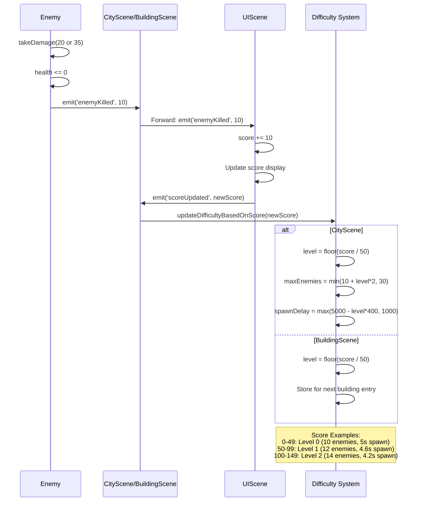
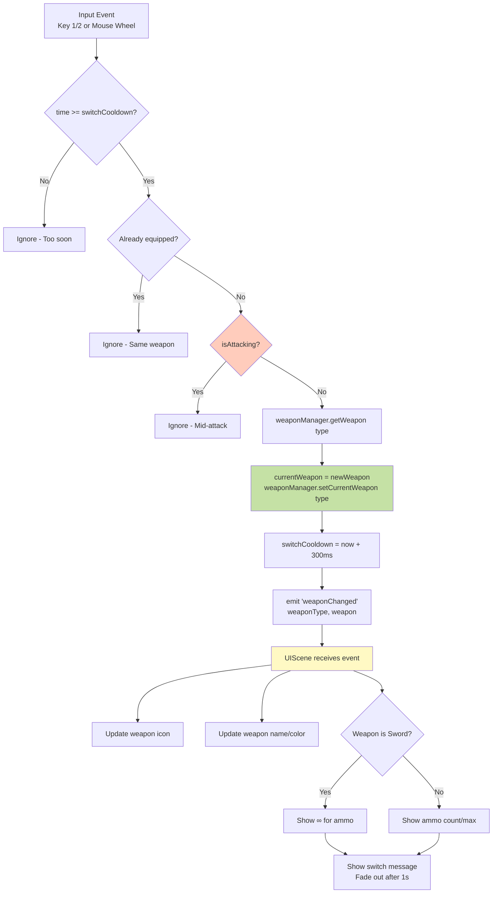
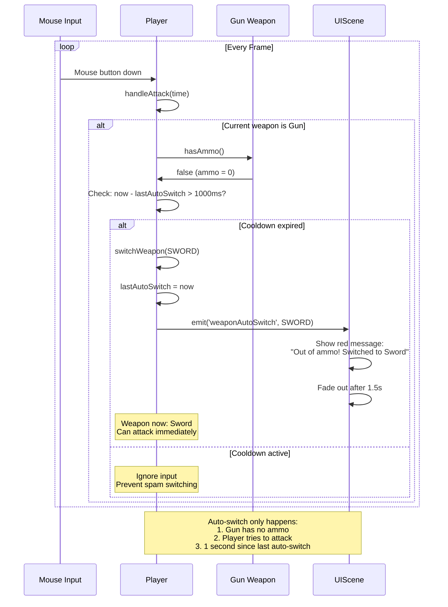
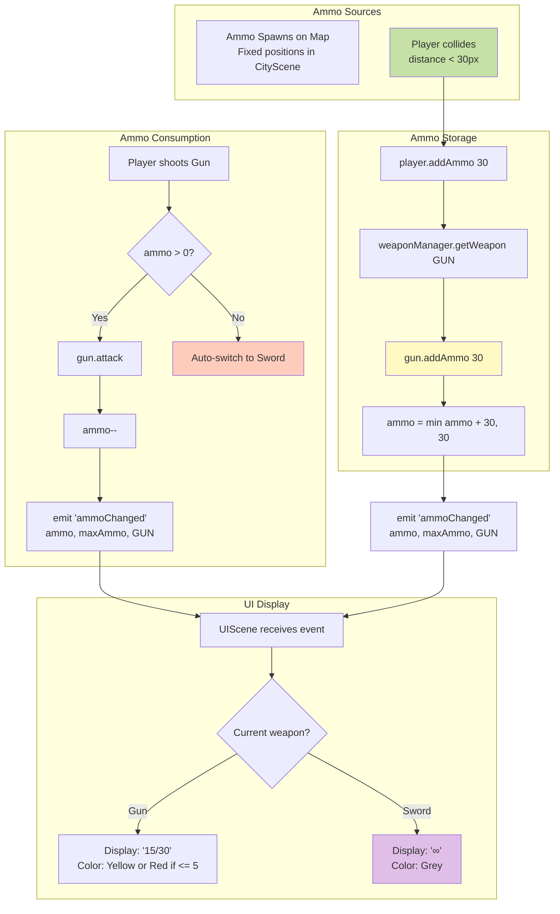
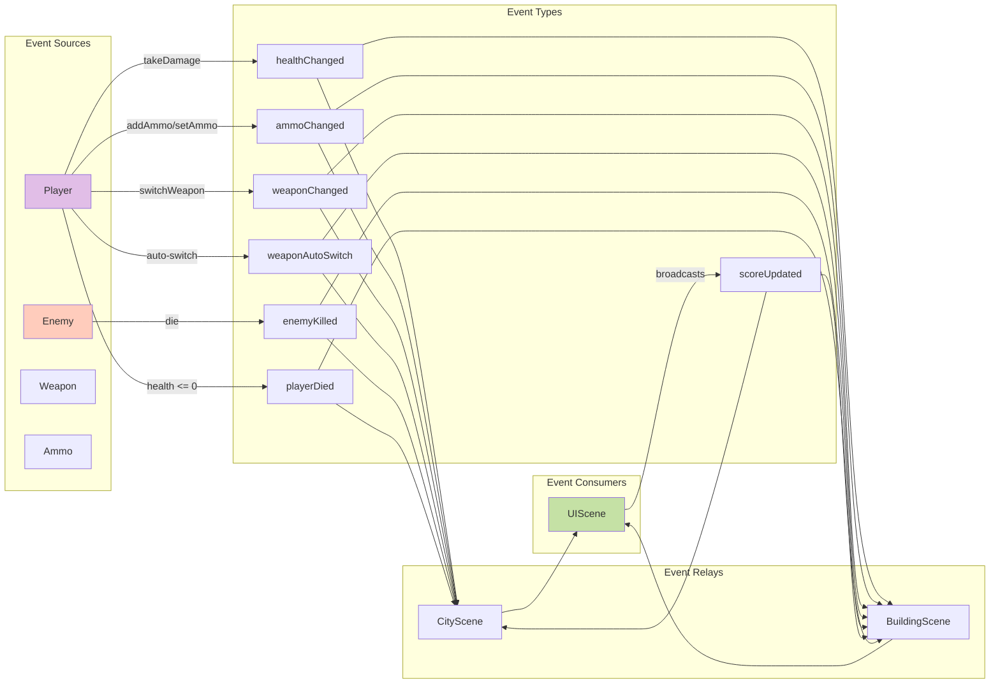
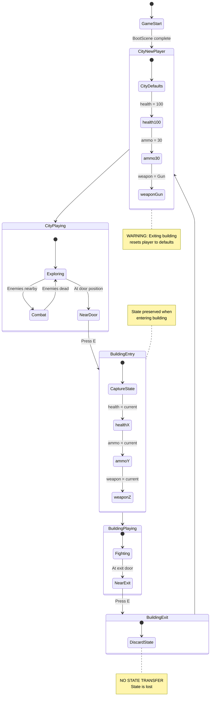

# Data Flow Documentation

## Scene State Management

```mermaid
graph TD
    subgraph "Initial State"
        Boot[BootScene Creates Assets] --> InitCity[CityScene: NEW Player<br/>Health: 100<br/>Ammo: 30<br/>Weapon: Gun]
        Boot --> InitUI[UIScene: Score = 0]
    end

    subgraph "Enter Building Flow"
        Playing[Playing in City] --> CheckDoor{Near Door?}
        CheckDoor -->|No| Playing
        CheckDoor -->|Yes, Press E| Capture[Capture State:<br/>health = player.getHealth<br/>ammo = player.getAmmo<br/>weapon = player.getCurrentWeapon]
        Capture --> Transfer[scene.start 'BuildingScene'<br/>Pass: buildingId, health, ammo, weapon]
        Transfer --> BuildingInit[BuildingScene.init<br/>Store: initialHealth, initialAmmo, initialWeapon]
        BuildingInit --> BuildingCreate[BuildingScene.create<br/>Create Player]
        BuildingCreate --> RestoreHP{Health < 100?}
        RestoreHP -->|Yes| DamagePlayer[player.takeDamage 100 - health]
        RestoreHP -->|No| SetAmmo[player.setAmmo initialAmmo]
        DamagePlayer --> SetAmmo
        SetAmmo --> SetWeapon[player.setWeapon initialWeapon]
        SetWeapon --> BuildingReady[Player Ready in Building]
    end

    subgraph "Exit Building Flow"
        BuildingPlay[Playing in Building] --> CheckExit{Near Exit?}
        CheckExit -->|No| BuildingPlay
        CheckExit -->|Yes, Press E| ExitStart[scene.start 'CityScene'<br/>NO STATE PASSED]
        ExitStart --> CityReset[CityScene creates<br/>NEW Player instance<br/>RESET to defaults]
        CityReset --> LostState[STATE LOST:<br/>Health: 100<br/>Ammo: 30<br/>Weapon: Gun]
    end

    style Capture fill:#fff3e0
    style Transfer fill:#e1f5fe
    style RestoreHP fill:#f3e5f5
    style ExitStart fill:#ffcdd2
    style LostState fill:#ffcdd2
```

## Score & Difficulty Flow

## Weapon Switching Data Flow

## Auto-Weapon Switch Flow

## Ammo System Data Flow

## Event Propagation Map

## Critical State Transitions

