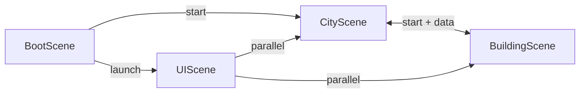

# Quick Reference Cheat Sheet

## Commands

```bash
npm run dev      # Start development server (localhost:3000)
npm run build    # Production build (TypeScript + Vite)
npm run preview  # Preview production build
```

## File Structure

```
src/
├── main.ts                    # Game initialization
├── scenes/                    # Game scenes
│   ├── BootScene.ts          # Asset generation
│   ├── CityScene.ts          # Main overworld
│   ├── BuildingScene.ts      # Building interiors
│   └── UIScene.ts            # Persistent HUD
├── entities/                  # Game entities
│   ├── Player.ts             # Player + weapon system
│   ├── Enemy.ts              # AI enemies
│   └── Ammo.ts               # Ammo pickups
├── weapons/                   # Weapon system
│   ├── IWeapon.ts            # Interface + enum
│   ├── Gun.ts                # Ranged weapon
│   └── Sword.ts              # Melee weapon
├── managers/
│   └── WeaponManager.ts      # Weapon inventory
└── utils/
    └── IsometricUtils.ts     # Coordinate math
```

## Scene Lifecycle



## Weapon Stats

| Weapon | Damage | Cooldown | Range | Ammo | Special |
|--------|--------|----------|-------|------|---------|
| Gun    | 20     | 200ms    | ∞     | 30   | Bullet pool |
| Sword  | 35     | 400ms    | 60px  | ∞    | 90° arc |

## Controls

| Action | Input |
|--------|-------|
| Move | WASD / Arrow Keys |
| Attack | Left Mouse (hold) |
| Weapon 1 (Gun) | Press 1 |
| Weapon 2 (Sword) | Press 2 |
| Cycle Weapons | Mouse Wheel |
| Enter/Exit | E (near door) |

## Difficulty Scaling

```
Level = floor(Score / 50)

City:
  maxEnemies = min(10 + level × 2, 30)
  spawnDelay = max(5000 - level × 400, 1000) ms

Building:
  enemies = random(2 + level, 4 + level)
  capped at 8-10
```

## Critical Events

```typescript
// Emitted by Player/Weapons
'healthChanged'     → (current, max)
'ammoChanged'       → (current, max, weaponType)
'weaponChanged'     → (weaponType, weapon)
'weaponAutoSwitch'  → (weaponType)

// Emitted by Enemy
'enemyKilled'       → (points)

// Emitted by Player
'playerDied'        → ()

// Emitted by UIScene
'scoreUpdated'      → (newScore)
```

## Isometric Math

```typescript
// Cartesian → Isometric
isoX = (cartX - cartY) × 32
isoY = (cartX + cartY) × 16

// Isometric → Cartesian
cartX = (isoX/32 + isoY/16) / 2
cartY = (isoY/16 - isoX/32) / 2

// Depth Sorting
depth = y + offset
```

## Common Patterns

### Creating New Weapon

```typescript
// 1. Implement IWeapon
export class NewWeapon implements IWeapon {
  attack(time, pointer, player) { /* ... */ }
  canAttack(time) { /* ... */ }
  // ... other methods
}

// 2. Add to WeaponManager
constructor(scene) {
  const newWeapon = new NewWeapon(scene);
  this.weapons.set(WeaponType.NEW, newWeapon);
}

// 3. Update enum
enum WeaponType {
  GUN = 'gun',
  SWORD = 'sword',
  NEW = 'new',
}
```

### Scene Transition with State

```typescript
// From CityScene to BuildingScene
this.scene.start('BuildingScene', {
  buildingId: number,
  playerHealth: this.player.getHealth(),
  playerAmmo: this.player.getAmmo(),
  currentWeapon: this.player.getCurrentWeaponType(),
});

// In BuildingScene.init()
init(data: BuildingData) {
  this.initialHealth = data.playerHealth || 100;
  this.initialAmmo = data.playerAmmo || 30;
  this.initialWeapon = data.currentWeapon || WeaponType.GUN;
}

// In BuildingScene.create()
this.player.setAmmo(this.initialAmmo);
this.player.setWeapon(this.initialWeapon);
```

### Emitting Events

```typescript
// From any entity
this.scene.events.emit('eventName', ...args);

// Listening in scene
this.events.on('eventName', (arg1, arg2) => {
  // Handle event
});

// Cross-scene listening (in UIScene)
const cityScene = this.scene.get('CityScene');
cityScene.events.on('eventName', (args) => {
  // Handle
});
```

### Collision Setup

```typescript
// Gun bullets
const bullets = this.player.getBullets();
if (bullets) {
  this.physics.add.overlap(
    bullets,
    enemies,
    this.handleCollision,
    undefined,
    this
  );
}

// Collision handler
handleCollision(bullet, enemy) {
  // Guard clauses
  if (!bullet.active) return;
  if (enemy.isEnemyDying()) return;

  // Disable bullet
  bullet.setActive(false);
  bullet.body.enable = false;

  // Apply damage
  enemy.takeDamage(20);
}
```

### Sword Arc Detection

```typescript
// In Sword.attack()
const enemies = (scene as any).enemies;
const aimAngle = Math.atan2(direction.y, direction.x);

enemies.getChildren().forEach((enemy: Enemy) => {
  // Distance check
  const dist = Phaser.Math.Distance.Between(
    player.x, player.y, enemy.x, enemy.y
  );
  if (dist > this.range) return;

  // Angle check
  const enemyAngle = Phaser.Math.Angle.Between(
    player.x, player.y, enemy.x, enemy.y
  );
  const diff = Phaser.Math.Angle.Wrap(enemyAngle - aimAngle);

  if (Math.abs(diff) <= Phaser.Math.DegToRad(45)) {
    if (!this.hitSet.has(enemy)) {
      enemy.takeDamage(35);
      this.hitSet.add(enemy);
    }
  }
});
```

## Map Tile Types

```
CityScene:
0 = ground
1 = road
2 = building
3 = water
4 = door

BuildingScene:
0 = floor
1 = wall
2 = exit door
```

## Asset Naming Convention

```
Tiles:        tile_ground, tile_road, tile_water, etc.
Player:       player_right, player_left, player_up, etc.
              player_upRight, player_downLeft, etc.
Enemies:      enemy_bug
Weapons:      weapon_gun_icon, weapon_sword_icon
              sword_sprite
Pickups:      ammo
Projectiles:  bullet
```

## Performance Tips

- Bullet pooling: max 50 bullets (Gun.ts)
- Enemy cap: 30 in city, 10 in buildings
- Particle lifespan: 100-300ms typical
- Depth updates: only for moving entities
- Event-driven: avoid polling in update loops

## Debugging Checklist

- [ ] Enemy has `isDying` flag check?
- [ ] Collision handler checks `active` and `isEnemyDying()`?
- [ ] Scene exposes `enemies` via getter for sword?
- [ ] Weapon switch checks cooldown and `isAttacking()`?
- [ ] Scene transition passes all state needed?
- [ ] Events emitted with correct parameters?
- [ ] Depth set correctly (y + offset)?
- [ ] TypeScript unused params prefixed with `_`?

## Constants

```typescript
TILE_WIDTH = 64
TILE_HEIGHT = 32
MAX_BULLET_POOL = 50
PLAYER_SPEED = 150
ENEMY_SPEED = 60
ENEMY_CHASE_SPEED = 90
DETECTION_RANGE = 300
ATTACK_RANGE = 30
WEAPON_SWITCH_COOLDOWN = 300
AUTO_SWITCH_COOLDOWN = 1000
```
