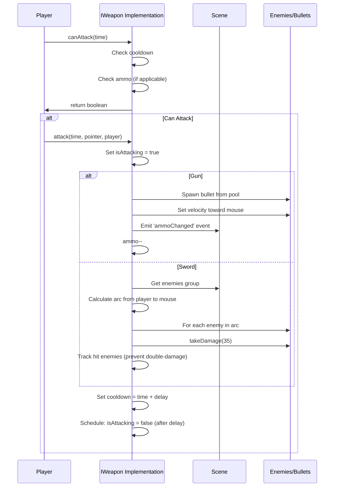
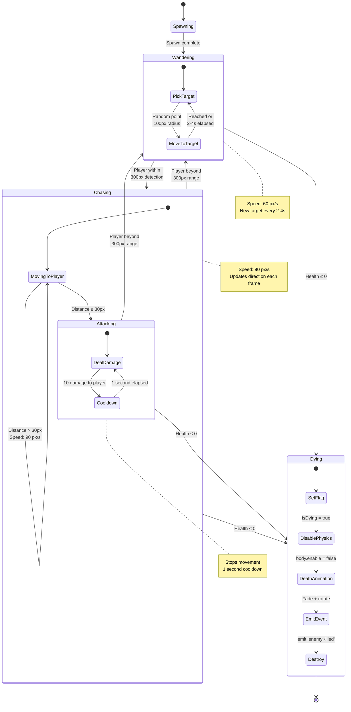
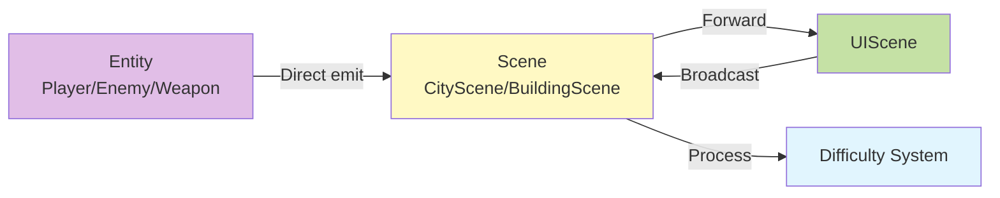
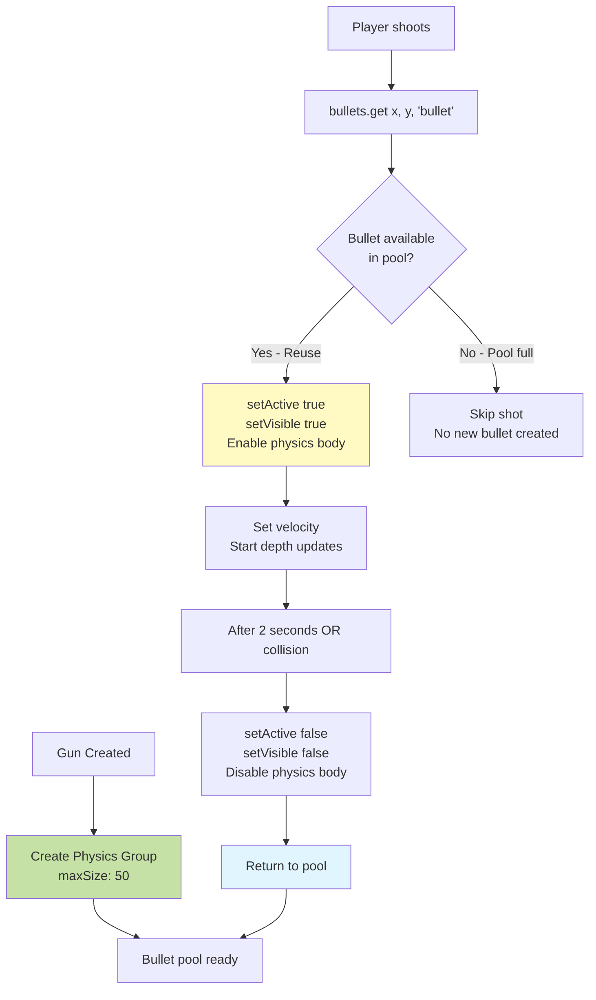

# Technical Reference

## Weapon System API

### IWeapon Interface

```typescript
interface IWeapon {
  // Core attack method called every frame when conditions met
  attack(time: number, pointer: Phaser.Input.Pointer, player: Player): void;

  // Check if weapon can attack (cooldown + ammo checks)
  canAttack(time: number): boolean;

  // Check if weapon has ammo available
  hasAmmo(): boolean;

  // Get current ammo count (-1 for unlimited)
  getAmmoCount(): number;

  // Get maximum ammo capacity (-1 for unlimited)
  getMaxAmmo(): number;

  // Add ammo to weapon (clamped to max)
  addAmmo(amount: number): void;

  // Set exact ammo amount (clamped to max)
  setAmmo(amount: number): void;

  // Get weapon cooldown in milliseconds
  getCooldown(): number;

  // Get damage per hit
  getDamage(): number;

  // Get weapon type enum
  getWeaponType(): WeaponType;

  // Check if currently in attack animation
  isAttacking(): boolean;

  // Optional: Get bullet pool (Gun only)
  getBullets?(): Phaser.Physics.Arcade.Group;
}
```

### Weapon Implementation Pattern



## Coordinate System Math

### Isometric Transformation Formulas

```mermaid
graph TD
    subgraph "Cartesian to Isometric"
        CartIn["Input: Cartesian x, y<br/>Example: 5, 3"]
        CalcX["isoX = cartX - cartY × TILE_WIDTH/2<br/>= 5, 3 × 32<br/>= 5 - 3 × 32 = 64"]
        CalcY["isoY = cartX + cartY × TILE_HEIGHT/2<br/>= 5, 3 × 16<br/>= 5 + 3 × 16 = 128"]
        CartOut["Output: Isometric 64, 128"]

        CartIn --> CalcX
        CalcX --> CalcY
        CalcY --> CartOut
    end

    subgraph "Isometric to Cartesian"
        IsoIn["Input: Isometric x, y<br/>Example: 64, 128"]
        CalcCartX["cartX = isoX/32 + isoY/16 / 2<br/>= 64/32 + 128/16 / 2<br/>= 2 + 8 / 2 = 5"]
        CalcCartY["cartY = isoY/16 - isoX/32 / 2<br/>= 128/16 - 64/32 / 2<br/>= 8 - 2 / 2 = 3"]
        IsoOut["Output: Cartesian 5, 3"]

        IsoIn --> CalcCartX
        CalcCartX --> CalcCartY
        CalcCartY --> IsoOut
    end

    subgraph "Constants"
        TW["TILE_WIDTH = 64"]
        TH["TILE_HEIGHT = 32"]
    end

    style CartIn fill:#e1f5fe
    style IsoIn fill:#f3e5f5
    style CartOut fill:#c5e1a5
    style IsoOut fill:#c5e1a5
```



### Depth Sorting Algorithm

```
Entity Depth = Y Position + Offset

Examples:
- Tile at (x, y): depth = y
- Player: depth = y + 10
- Bullet: depth = y + 10 (updates each frame as bullet moves)
- Muzzle flash: depth = y + 11 (above player/bullet)
- Building: depth = y + 100 (always in background)
- Sword effect: depth = y + 12 (above everything)

Rule: Higher Y = Closer to camera = Rendered on top
```

## Collision System Architecture

```mermaid
graph TD
    subgraph "Physics Setup (Game Start)"
        Setup[Scene.setupCollisions]
        Setup --> GunSetup{Weapon has bullets?}
        GunSetup -->|Yes| BulletCollider[physics.add.overlap<br/>bullets, enemies, handler]
        GunSetup -->|No| Skip1[Skip - Sword has no bullets]

        Setup --> WallCollider[physics.add.collider<br/>player, walls/buildings]
    end

    subgraph "Gun Collision Detection (Every Frame)"
        BulletCheck[Phaser Arcade Physics<br/>Checks bullet bounds vs enemy bounds]
        BulletCheck -->|Overlap detected| Handler[handleBulletEnemyCollision]

        Handler --> Guard1{bullet.active?}
        Guard1 -->|No| Abort1[Abort - bullet already hit]
        Guard1 -->|Yes| Guard2{enemy.isEnemyDying?}
        Guard2 -->|Yes| Abort2[Abort - enemy already dying]
        Guard2 -->|No| Process[Process hit]

        Process --> DisableB[bullet.setActive false<br/>bullet.body.enable = false]
        DisableB --> HitFX[Show hit particle effect]
        HitFX --> Damage[enemy.takeDamage 20]
    end

    subgraph "Sword Hit Detection (On Attack)"
        SwordAttack[Sword.attack called]
        SwordAttack --> GetEnemies[scene.enemies or<br/>scene.getEnemies]
        GetEnemies --> CalcAngle[Calculate aim angle<br/>from player to mouse]

        CalcAngle --> Loop[For each enemy in group]
        Loop --> CheckActive{enemy.active &&<br/>!enemy.isEnemyDying?}
        CheckActive -->|No| Next1[Skip to next]
        CheckActive -->|Yes| CheckDist{Distance player to enemy<br/>≤ 60 pixels?}

        CheckDist -->|No| Next2[Skip to next]
        CheckDist -->|Yes| CheckAngle{Angle difference<br/>≤ ±45°?}

        CheckAngle -->|No| Next3[Skip to next]
        CheckAngle -->|Yes| CheckHit{Enemy in<br/>hit Set?}

        CheckHit -->|Yes| Next4[Skip - already hit this swing]
        CheckHit -->|No| SwordDamage[enemy.takeDamage 35<br/>Add enemy to hit Set]

        SwordDamage --> Next5[Next enemy]
        Next1 --> Next5
        Next2 --> Next5
        Next3 --> Next5
        Next4 --> Next5
    end

    style Handler fill:#ffccbc
    style Process fill:#c5e1a5
    style SwordDamage fill:#c5e1a5
    style CheckHit fill:#fff9c4
```



## Enemy AI State Machine



## Event System Reference

### Event Emission Points

| Event | Emitted By | Payload | Purpose |
|-------|-----------|---------|---------|
| `healthChanged` | Player.takeDamage()<br/>Player.heal() | (current: number, max: number) | Update health bar in UI |
| `ammoChanged` | Gun.attack()<br/>Gun.addAmmo()<br/>Gun.setAmmo() | (current: number, max: number, weaponType: WeaponType) | Update ammo display in UI |
| `weaponChanged` | Player.switchWeapon() | (weaponType: WeaponType, weapon: IWeapon) | Update weapon UI, ammo display |
| `weaponAutoSwitch` | Player.handleAttack() | (weaponType: WeaponType) | Show auto-switch warning |
| `enemyKilled` | Enemy.die() | (points: number) | Add score, trigger difficulty update |
| `playerDied` | Player.takeDamage() | () | Show game over screen |
| `scoreUpdated` | UIScene.updateScore() | (newScore: number) | Broadcast to scenes for difficulty |

### Event Flow Pattern



## Difficulty Scaling Formulas

### CityScene Scaling

```
Input: score (integer)
difficultyLevel = floor(score / 50)

maxEnemies = min(baseMaxEnemies + difficultyLevel × 2, 30)
           = min(10 + floor(score/50) × 2, 30)

spawnDelay = max(baseSpawnDelay - difficultyLevel × 400, 1000)
           = max(5000 - floor(score/50) × 400, 1000)

Examples:
Score    Level    Max Enemies    Spawn Delay
0        0        10             5000ms
50       1        12             4600ms
100      2        14             4200ms
200      4        18             3400ms
500      10       30             1000ms (capped)
1000     20       30             1000ms (capped)
```

### BuildingScene Scaling

```
Input: score (integer)
difficultyLevel = floor(score / 50)

minEnemies = min(baseMin + difficultyLevel, 8)
           = min(2 + floor(score/50), 8)

maxEnemies = min(baseMax + difficultyLevel, 10)
           = min(4 + floor(score/50), 10)

actualSpawn = random(minEnemies, maxEnemies)

Examples:
Score    Level    Enemy Range    Avg Spawn
0        0        2-4            3
50       1        3-5            4
100      2        4-6            5
200      4        6-8            7
400      8        10-10          10 (capped)
```

## Performance Considerations

### Object Pooling (Gun)



### Depth Update Strategy

```
Problem: Bullets move, requiring depth recalculation for isometric rendering

Solution: Timed event loop (Gun.ts:73-85)
- Create timer: 16ms interval (~60 FPS)
- Update depth each tick: bullet.setDepth(bullet.y + 10)
- Stop conditions:
  * Bullet becomes inactive
  * 2 second timeout
  * Collision with enemy
- Clean up timer on stop

Performance impact:
- ~1-10 active bullets typical
- 60 depth updates/second per bullet
- Minimal overhead vs correctness benefit
```

## Critical Implementation Notes

### 1. isDying Flag Pattern (Enemy.ts:144)

```typescript
// WRONG - Causes double-damage
die() {
  this.setActive(false);
  // Collision callback can still trigger here!
  enemy.takeDamage(20);
}

// CORRECT - Flag prevents re-entry
die() {
  if (this.isDying) return;  // Guard clause
  this.isDying = true;         // Set flag FIRST
  this.setActive(false);
  this.body.enable = false;
  // Now safe from collision callbacks
}

// Collision handler checks flag
handleCollision(bullet, enemy) {
  if (enemy.isEnemyDying()) return;  // Skip if dying
  enemy.takeDamage(20);
}
```

### 2. Scene Enemy Access (Sword.ts:99-101)

```typescript
// Sword needs enemies but doesn't have direct reference
// Pattern: Access via scene property

attack(time, pointer, player) {
  const currentScene = this.scene as any;
  const enemies = currentScene.enemies || currentScene.getEnemies?.();

  if (!enemies) return;  // Guard - scene might not have enemies

  // Now can iterate and check arc
  this.detectEnemiesInArc(player, aimAngle, enemies);
}

// Scenes MUST expose enemies:
class CityScene {
  private enemies: Phaser.Physics.Arcade.Group;

  getEnemies() { return this.enemies; }  // Public accessor
}
```

### 3. Weapon Switch Cooldown Stack (Player.ts:176-198)

```typescript
// Multiple cooldown types prevent exploits:

// 1. Global switch cooldown (300ms)
if (now < this.weaponSwitchCooldown) return;

// 2. Active attack prevention
if (this.currentWeapon.isAttacking()) return;

// 3. Auto-switch cooldown (1000ms)
if (now - this.lastAutoSwitch < this.autoSwitchCooldown) return;

// 4. Same weapon prevention
if (this.currentWeapon.getWeaponType() === weaponType) return;
```

### 4. Ammo Independence (Player.ts:241-247)

```typescript
// Gun ammo persists even when sword equipped
// Pattern: Always target gun specifically

addAmmo(amount) {
  const gun = this.weaponManager.getWeapon(WeaponType.GUN);
  if (gun) {
    gun.addAmmo(amount);  // Updates gun, not current weapon
  }
}

// UI shows different info based on equipped weapon
updateAmmoDisplay(weaponType) {
  if (weaponType === SWORD) {
    show('∞');  // Sword doesn't use ammo
  } else {
    const gun = getWeapon(GUN);
    show(`${gun.ammo}/${gun.maxAmmo}`);  // Always show gun ammo
  }
}
```
